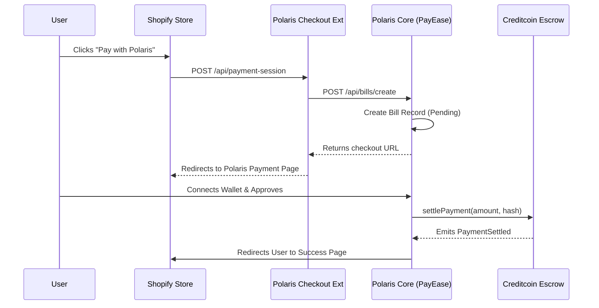

# 🌌 Polaris Core

Polaris Core is the heartbeat of the Polaris Protocol, providing the essential infrastructure for decentralized lending, private swaps, and institutional-grade AMM pools. It serves as the primary application layer for users to interact with the protocol's liquidity and privacy features.

## 🚀 Deployed Contracts (Localhost/Hardhat)
All contracts are currently deployed on the Hardhat local network (Chain ID: 31337).

### 🏦 Mock Tokens
| Token | Address |
|-------|---------|
| **WETH** | `0x5eb3Bc0a489C5A8288765d2336659EbCA68FCd00` |
| **BNB**  | `0x36C02dA8a0983159322a80FFE9F24b1acfF8B570` |
| **USDC** | `0x809d550fca64d94Bd9F66E60752A544199cfAC3D` |
| **USDT** | `0x4c5859f0F772848b2D91F1D83E2Fe57935348029` |

### 📈 Lending Pools
| Token | Address | Collateral Ratio | Interest Rate |
|-------|---------|------------------|---------------|
| **WETH** | `0x1291Be112d480055DaFd8a610b7d1e203891C274` | 150% | 5% APR |
| **BNB**  | `0x5f3f1dBD7B74C6B46e8c44f98792A1dAf8d69154` | 150% | 5% APR |
| **USDC** | `0xb7278A61aa25c888815aFC32Ad3cC52fF24fE575` | 120% | 3% APR |
| **USDT** | `0xCD8a1C3ba11CF5ECfa6267617243239504a98d90` | 120% | 3% APR |

### 🔐 Private Swap (FHEVM Powered)
| Token | Address |
|-------|---------|
| **WETH** | `0x82e01223d51Eb87e16A03E24687EDF0F294da6f1` |
| **BNB**  | `0x2bdCC0de6bE1f7D2ee689a0342D76F52E8EFABa3` |
| **USDC** | `0x7969c5eD335650692Bc04293B07F5BF2e7A673C0` |
| **USDT** | `0x7bc06c482DEAd17c0e297aFbC32f6e63d3846650` |

### 🌊 AMM Pools
| Pair | Address | Initial Liquidity |
|------|---------|-------------------|
| **BNB-USDC** | `0xc351628EB244ec633d5f21fBD6621e1a683B1181` | 100 BNB + 30,000 USDC |
| **BNB-USDT** | `0xFD471836031dc5108809D173A067e8486B9047A3` | 100 BNB + 30,000 USDT |
| **WETH-USDC** | `0x51A1ceB83B83F1985a81C295d1fF28Afef186E02` | 50 WETH + 100,000 USDC |
| **WETH-USDT** | `0x36b58F5C1969B7b6591D752ea6F5486D069010AB` | 50 WETH + 100,000 USDT |

---

## 🏗️ Architecture Everything

The Polaris Protocol is designed with a modular, scalable architecture consisting of four primary layers:

### 1. Smart Contract Layer (`polaris-protocol`)
- **Core Engine**: `LoanEngine.sol` and `PoolManager.sol` manage current state and transactions.
- **Privacy Engine**: Integrated FHEVM (Fully Homomorphic Encryption) for private transactions.
- **Asset Hub**: `LiquidityVault.sol` manages deposits and cross-chain oracle interfaces (anchored via Creditcoin).

### 2. Real-Time Data Layer (Convex & Supabase)
- **Convex**: Handles real-time transaction tracking and global protocol state indexing.
- **Supabase**: Primary database for user settings, merchant profiles, and historical analytics.

### 3. Application Layer (`polaris-core`)
- **Next.js 14**: Modern App-router based frontend using Server Components for performance.
- **Hook-Driven**: custom React hooks in `hooks/` interface with both smart contracts and the real-time data layer.
- **Theming**: Premium dark-mode aesthetics using TailwindCSS and Framer Motion.

---

## 🔄 Core Workflows

### 🛡️ Cross-Chain Bridge Flow
1.  **Source Chain (Sepolia)**: User calls `deposit(token, amount)` on `LiquidityVault`.
2.  **Relayer**: Detects event, submits proof to **Creditcoin Oracle**.
3.  **Oracle**: Verifies finality and returns a `queryId`.
4.  **Master Hub (USC Testnet)**: User/Relayer calls `addLiquidityFromProof(queryId)` to update global state.

### 💳 Payment Gateway Flow (Shopify Integration)


---

## 🛠️ Development & Setup

### Requirements
- Node.js >= 18
- pnpm / npm
- Local Hardhat node running (from `polaris-protocol`)

### Installation
```bash
pnpm install
```

### Run Locally
```bash
npm run dev
```

---

## 📊 Directory Structure
- `app/`: Next.js pages and layouts.
- `components/`: Reusable UI components.
- `hooks/`: Blockchain and data fetching hooks.
- `lib/`: Utility functions and shared logic.
- `convex/`: Real-time backend functions.
- `public/`: Static assets.
