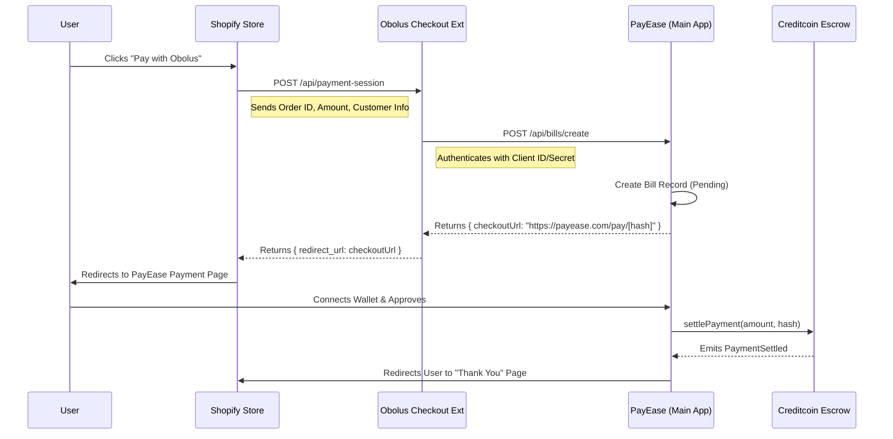

# Obolus Protocol Architecture

## 1. Core Bridge Architecture (Real Cross-Chain)
> **Creditcoin (USC) Decentralized Oracle** trustlessly bridges liquidity and data from Source Chains (Sepolia) to the Master Hub (USC Testnet).

### Flow Overview
1.  **Source Chain (Sepolia)**: `LiquidityVault` custodies assets.
    *   Action: `deposit(token, amount)`
    *   Event: `LiquidityDeposited` serves as the "Source of Truth".
2.  **The Bridge (Relayer)**:
    *   Detects deposit event.
    *   Submits transaction hash to Creditcoin Oracle via `submit_query`.
    *   Oracle verifies finality (~15 mins) and returns a `queryId`.
3.  **Master Hub (USC Testnet)**: `PoolManager` logic.
    *   User/Relayer calls `addLiquidityFromProof(queryId)`.
    *   Contract verifies data against Oracle and updates Global LP Configuration.

---

## 2. Payment Gateway Architecture (Shopify Integration)
> **PayEase** acts as the central payment processor, enabling instant crypto settlements for e-commerce platforms like Shopify.

### Offsite Payment Flow
We utilize a **Redirect-Based** architecture to securely handle payments off-platform, ensuring users pay via their Web3 wallets on our trusted interface.

### Components
1.  **Obolus Shopify App**: A lightweight middleware installed on the merchant's store.
    *   **Role**: Credential management & Request forwarding.
    *   **Endpoint**: `/api/payment-session`
2.  **PayEase (Main App)**: The central hub for all payment processing.
    *   **Role**: Bill generation, Wallet connection, Smart Contract interaction.
    *   **Endpoint**: `/api/bills/create` (S2S), `/pay/[hash]` (Client UI).
3.  **Smart Contracts**:
    *   **MerchantApps**: Stores merchant config (Escrow params).
    *   **Bills**: Tracks payment status and transaction hashes on-chain.
